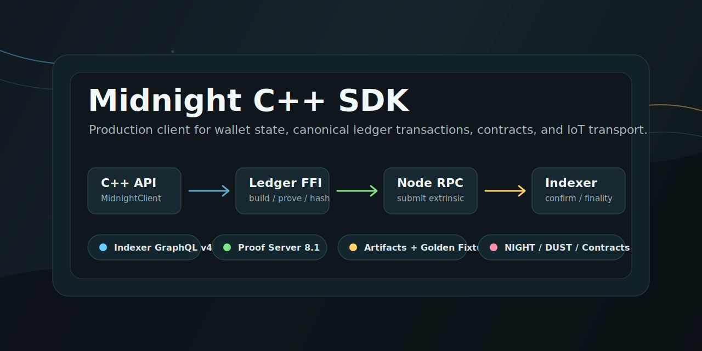

# Midnight C++ SDK



Production-grade C++20 SDK for building applications on Midnight. The SDK keeps
C++ as the public API while delegating canonical wallet derivation,
transaction construction, proving, serialization, and transaction hashing to the
native Midnight ledger FFI built from the official Midnight Rust sources.

It also includes IoT-oriented transports that can be used by future device and
gateway products: HTTP, WebSocket, MQTT, CoAP, sessions, state management, and
observability-friendly logging.

## Current Status

- Canonical Midnight transaction path: `prepare -> prove/build -> submit -> confirm/finality`.
- Supported operations: NIGHT transfer, DUST register/deregister, contract deploy/call smoke helpers, and custom Compact intent submission.
- Read paths: Indexer GraphQL v4 for blocks, transactions, UTXOs, wallet state, and contract queries.
- Node paths: JSON-RPC and WebSocket fallback for `author_submitExtrinsic` and contract state.
- State paths: local cache, snapshot import/export, and managed-state service interface.
- Shared SDK contract: [docs/SDK_SPEC.md](docs/SDK_SPEC.md).
- Cross-language test vectors: [golden-fixtures/](golden-fixtures/README.md).

Live submit tests are gated and never run by default in CI.

## Architecture

```text
C++ application
  -> midnight::production::MidnightClient
  -> native libmidnight_ledger_ffi
  -> proof server
  -> Midnight node JSON-RPC / WebSocket
  -> Midnight indexer GraphQL v4
  -> artifacts + confirmation/finality result
```

The SDK owns configuration, validation, networking, GraphQL, JSON-RPC,
WebSocket fallback, artifact persistence, finality polling, and typed errors.

The native ledger FFI owns canonical Midnight-specific work: address derivation,
ledger context replay, transaction build/prove, serialization, transaction hash,
transaction inspection, and deploy contract-address extraction.

## Repository Layout

```text
include/midnight/        Public C++ headers
src/                     SDK implementation
examples/                Buildable examples and live Preview helper flow
tests/                   Unit, integration, fixture, and gated live tests
tools/                   Developer/live network helper scripts
docs/                    API, architecture, handoff, and SDK spec docs
golden-fixtures/         Shared vectors for other language SDKs
midnight-research/       Local Midnight source-of-truth dependencies
```

Local secrets, caches, and live artifacts are intentionally ignored:

```text
.secrets/
midnight_cache/
midnight-artifacts/
build*/
```

## Build

```bash
cmake -S . -B build -DCMAKE_BUILD_TYPE=Release -DMIDNIGHT_BUILD_LEDGER_FFI=ON
cmake --build build -j 4
ctest --test-dir build --output-on-failure
```

Build only the native ledger backend:

```bash
cargo build \
  --manifest-path midnight-research/midnight-node/Cargo.toml \
  --package midnight-ledger-ffi \
  --release \
  --target-dir build/midnight-ledger-ffi
```

## Minimal C++ Usage

```cpp
#include "midnight/production/midnight_client.hpp"

auto config = midnight::production::ClientConfig::from_environment();
config.network_name = "preview";
config.ledger_ffi_library = "/absolute/path/to/libmidnight_ledger_ffi.dylib";

midnight::production::MidnightClient client(config);

midnight::ledger::TransferNightParams tx;
tx.source.src_url = "wss://rpc.preview.midnight.network";
tx.source.fetch_only_cached = true;
tx.source.fetch_cache = "redb:midnight_cache/live_submit_fetch_cache.db";
tx.source.ledger_state_db = "midnight_cache/live_submit_ledger_state_db";
tx.source_seed = "<seed-or-mnemonic>";
tx.destination_addresses = {"mn_addr_preview1..."};
tx.amount = "1000000"; // u128 decimal string

midnight::production::PipelineOptions options;
options.artifacts.root_dir = "midnight-artifacts";
options.artifacts.network = "preview";
options.artifacts.wallet_id = "preview-local";

auto result = client.transfer_night(options, tx);
if (!result.success) {
    throw std::runtime_error(result.error.message + ": " + result.error.detail);
}
```

## Live Preview Workflow

Start a ledger-compatible proof server first. Then:

```bash
export MIDNIGHT_NETWORK=preview

tools/midnight-preprod-live.sh generate-wallet
tools/midnight-preprod-live.sh print-faucet
tools/midnight-preprod-live.sh proof-health
tools/midnight-preprod-live.sh sync-ledger-state
tools/midnight-preprod-live.sh enable-local-mode
tools/midnight-preprod-live.sh prepare-live-submit
tools/midnight-preprod-live.sh transfer-night
tools/midnight-preprod-live.sh hello-contract-flow
```

`prepare-live-submit` is the recommended preflight for developers. It checks the
proof server, validates local-cache readiness, refreshes the cache tail when it
is stale, backs up only the derived ledger-state cache when state-root
verification has failed, and prints the final wallet balance.

The helper script name still says `preprod`, but it supports `preview`,
`preprod`, and other configured networks through `MIDNIGHT_NETWORK`.

## Environment

Common environment variables:

```text
MIDNIGHT_NETWORK=preview
MIDNIGHT_NODE_URL=https://rpc.preview.midnight.network
MIDNIGHT_SOURCE_URL=wss://rpc.preview.midnight.network
MIDNIGHT_INDEXER_URL=https://indexer.preview.midnight.network/api/v4/graphql
MIDNIGHT_PROOF_SERVER_URL=http://127.0.0.1:6300
MIDNIGHT_LEDGER_FFI_LIBRARY=/absolute/path/to/libmidnight_ledger_ffi.dylib
MIDNIGHT_STATE_MODE=local-cache
```

Live helper variables are stored under `.secrets/midnight-<network>/live.env`.
Do not commit that directory.

## Contracts

The SDK exposes two contract paths:

- `deploy_simple_contract` / `call_simple_contract`: live smoke-test helpers
  using static contract assets from `midnight-research`.
- `custom_contract_transaction`: production path for real Compact-generated
  deploy/call intent files.

A minimal Compact example is available at
[examples/contracts/hello-world](examples/contracts/hello-world/README.md).
Compile it with a ledger-compatible Compact toolchain, generate intents, then
submit them through `custom_contract_transaction`.

## Documentation

- [SDK specification](docs/SDK_SPEC.md)
- [Current implementation handoff](docs/MIDNIGHT_CXX_SDK_CONTEXT.md)
- [API reference](docs/MIDNIGHT_API_REFERENCE.md)
- [Architecture](docs/ARCHITECTURE.md)
- [Getting started](docs/GETTING_STARTED.md)
- [GraphQL queries](docs/midnight_graphql_queries.md)
- [UTXO protocol notes](docs/MIDNIGHT_UTXO_PROTOCOL.md)
- [Golden fixtures](golden-fixtures/README.md)

## Verification

Default verification:

```bash
cmake --build build -j 4
ctest --test-dir build --output-on-failure
bash -n tools/midnight-preprod-live.sh
git diff --check
```

Gated live submit tests require explicit opt-in:

```bash
export MIDNIGHT_RUN_LIVE_SUBMIT_TESTS=1
ctest --test-dir build --output-on-failure
```

## License

Apache License 2.0.
